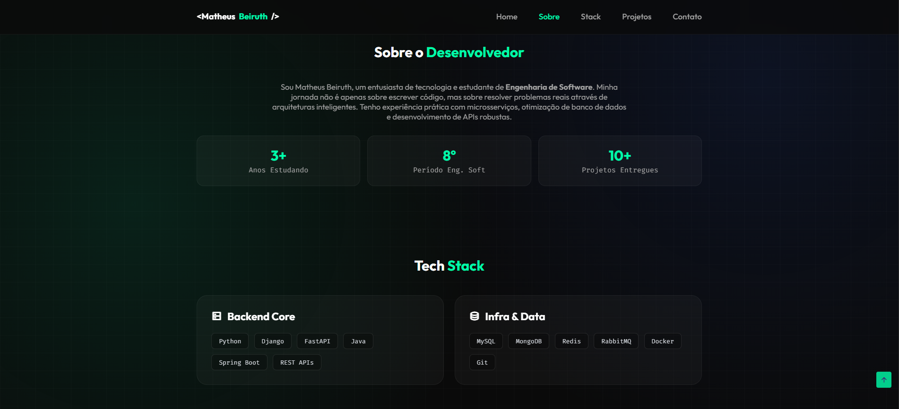

# ⚡ BeiruthDEV Portfolio


> 🌐 **Live Demo:** [https://beiruthdev.github.io](https://beiruthdev.github.io)

Um portfólio profissional projetado para destacar habilidades de **Engenharia de Software e Backend Development**. Construído com foco em design moderno (**Glassmorphism & Dark Mode**), performance e responsividade.


*(Adicione um print do seu site aqui com o nome preview.png na pasta assets/img)*

---

## 🛠️ Tecnologias & Conceitos

Este projeto não utiliza frameworks pesados propositalmente. A ideia foi utilizar a tríade web pura para garantir **máxima performance** e controle total do layout.

* **HTML5 Semântico**: Estrutura acessível e organizada (SEO friendly).
* **CSS3 Moderno**:
    * *Glassmorphism UI*: Efeitos de vidro fosco para profundidade.
    * *CSS Variables*: Fácil manutenção de temas e cores.
    * *Flexbox & Grid Layout*: Responsividade total.
    * *Animations*: Keyframes para efeitos de "respiração" e glow.
* **JavaScript (ES6+)**:
    * Manipulação de DOM para menu mobile.
    * Integração com API de formulário (Fetch API).
    * **ScrollReveal.js**: Biblioteca leve para animações de entrada.

---

## 🚀 Funcionalidades

- [x] **Tema "Cyberpunk/Tech"**: Fundo com grid vetorial e iluminação ambiente fixa.
- [x] **Formulário Funcional**: Envio de e-mails via AJAX (sem refresh) integrado ao FormSubmit.
- [x] **Feedback Visual**: Botões com estados de carregamento (Loading/Success/Error).
- [x] **Responsividade**: Adaptável para Celulares, Tablets e Desktops Ultrawide.
- [x] **Animações**: Elementos surgem suavemente ao rolar a página.

---

## 🔧 Como Rodar Localmente

Sendo um projeto estático, é muito simples de executar.

1. **Clone o repositório:**
   ```bash
   git clone [https://github.com/BeiruthDEV/BeiruthDEV.github.io.git](https://github.com/BeiruthDEV/BeiruthDEV.github.io.git)
   ```


Acesse a pasta:

```bash
cd BeiruthDEV.github.io
```


## 📄 Estrutura de Pastas

```bash

BeiruthDEV.github.io/
├── assets/
│   ├── css/
│   │   └── styles.css       # Estilos globais e responsivos
│   ├── img/                 # Imagens do perfil e projetos
│   └── js/
│       ├── main.js          # Lógica do menu e formulário
│       └── scrollreveal.js  # Lib de animação
├── index.html               # Estrutura principal
└── README.md                # Documentação
```

## 📝 Licença
Este projeto está sob a licença MIT. Sinta-se livre para usar como base para o seu próprio portfólio.

<div align="center"> <sub>Desenvolvido por <a href="https://github.com/BeiruthDEV">Matheus Beiruth</a> 🚀</sub> </div>